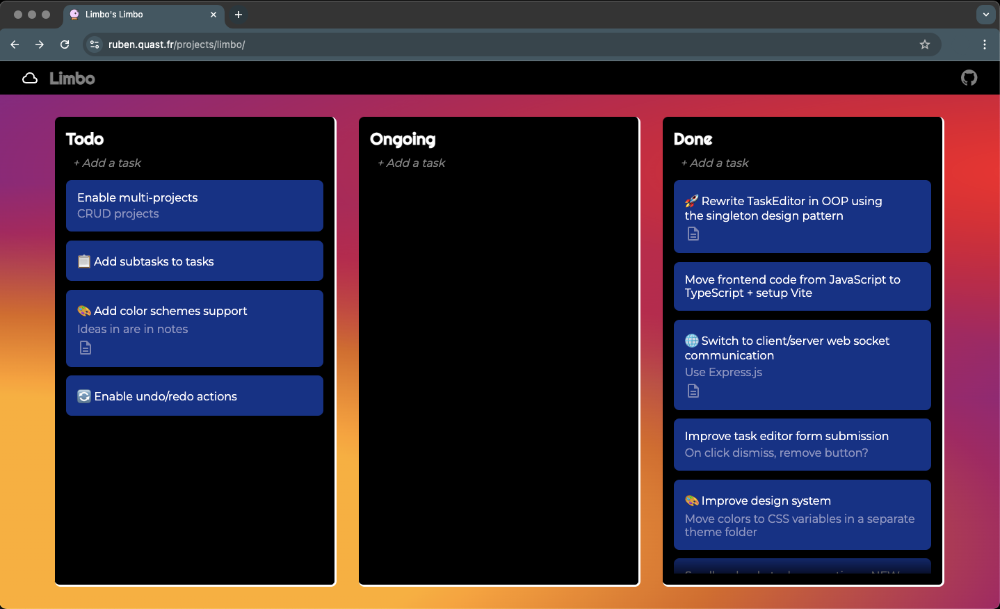

# 🔮 Limbo

**Limbo** (*Locally Implemented, Maniacally Backed-up Organizer*) is an local, offline project planner.

> **[🚀 Live Demo](https://ruben.quast.fr/projects/limbo/)**



## Getting started

```bash
npm install
npm start
```

The default port is **8080**, but you can change it in the [package.json](./package.json?plain=1#L6).


## Dev mode

```bash
npm run dev
```

In dev mode, [Vite](https://vite.dev/) is used as a middleware to enable HMR on the client side code.
